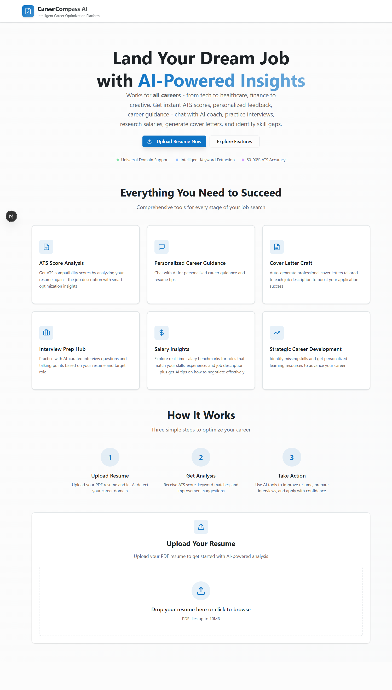
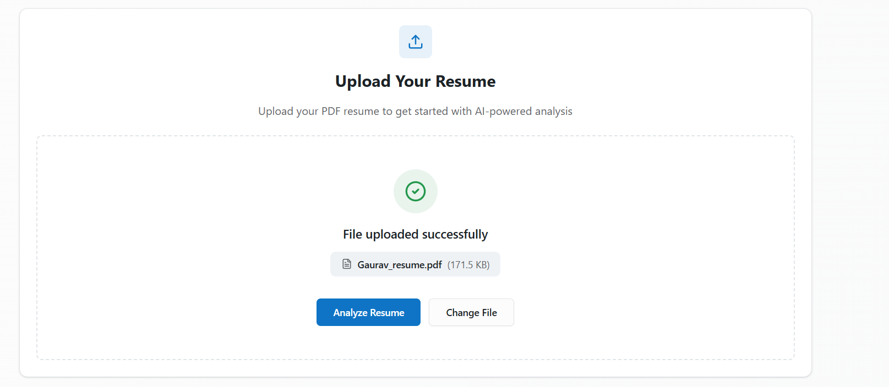
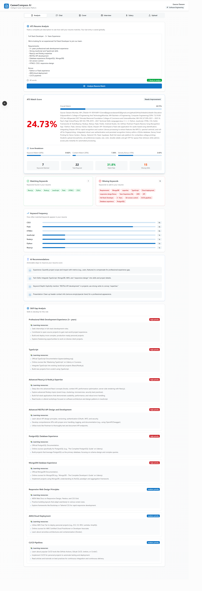
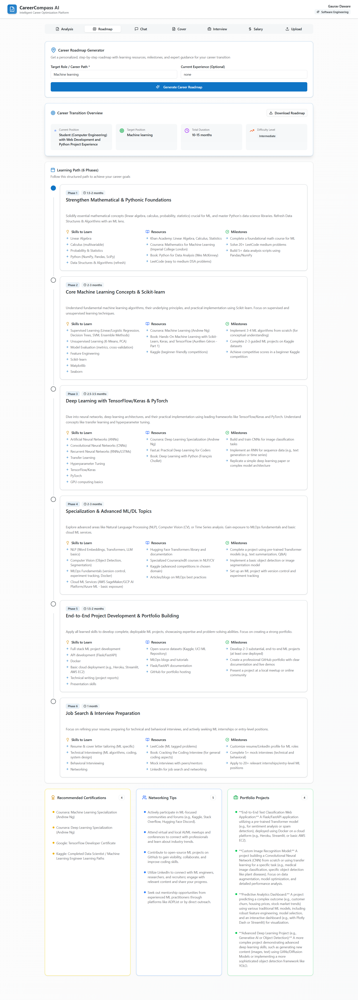
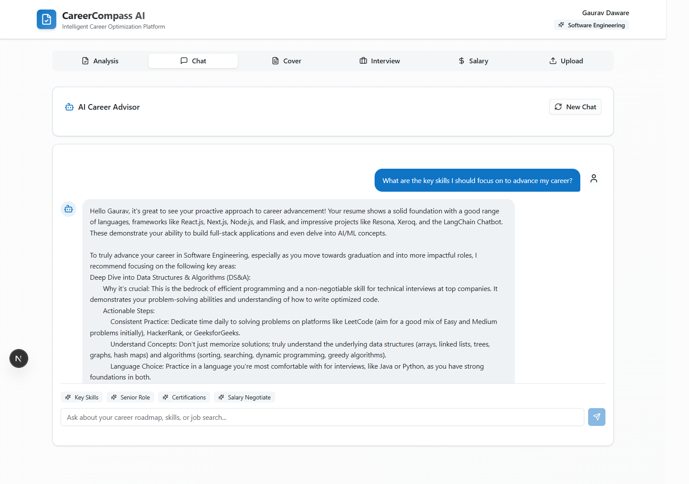
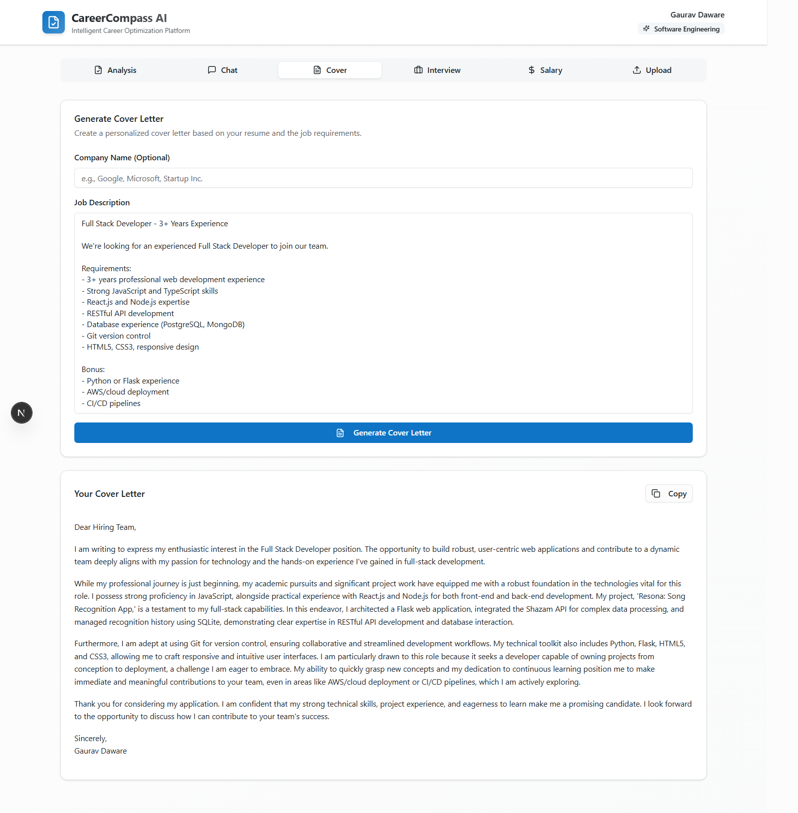
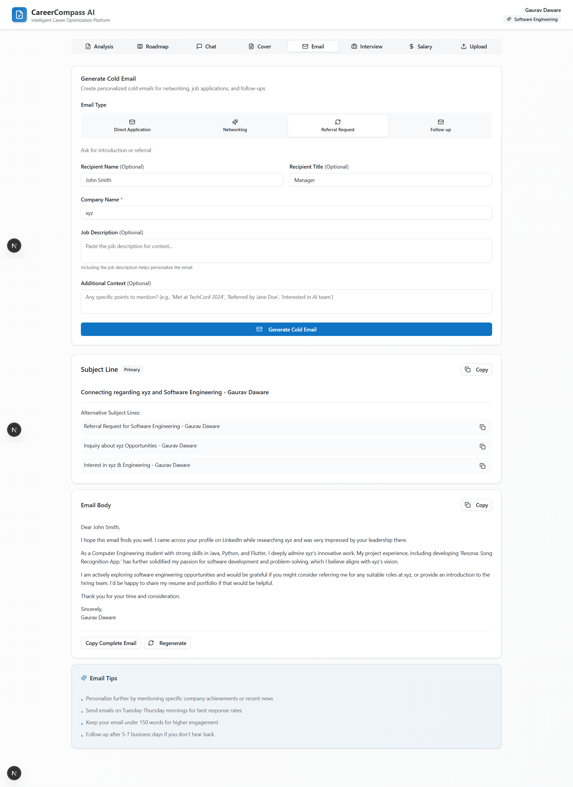
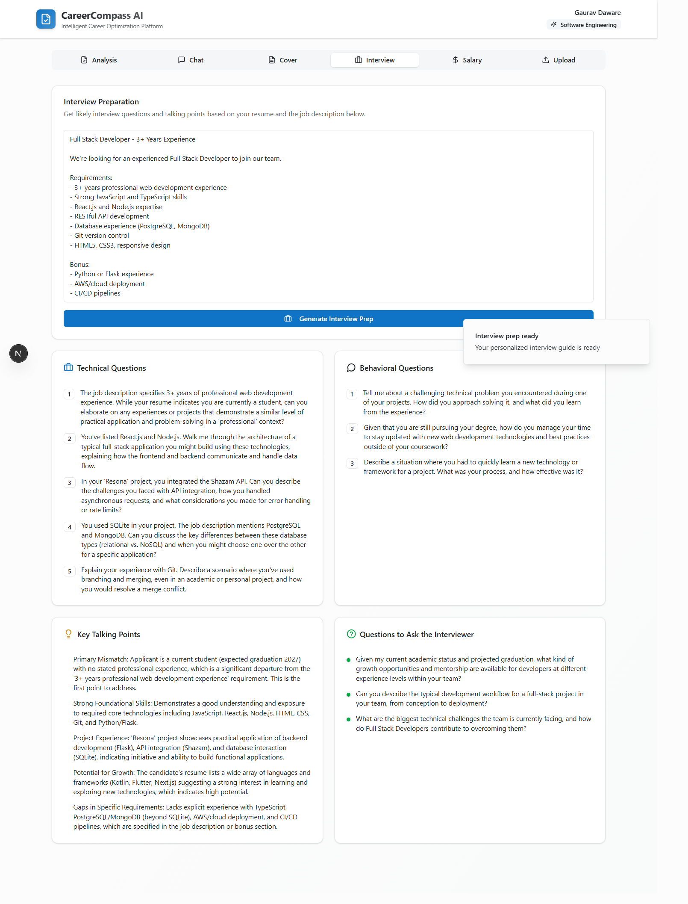
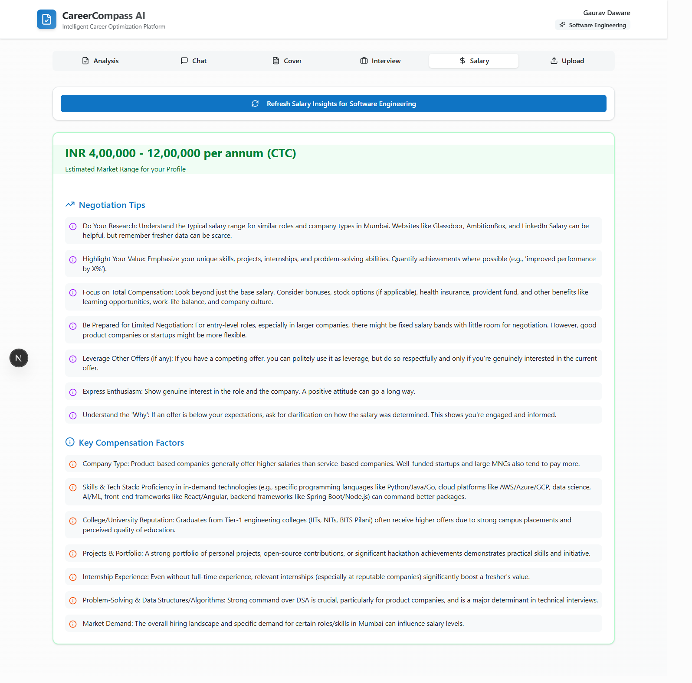

# CareerCompass Ai - Intelligent Career Optimization Platform

A complete full-stack application: Analyze your resume with ATS Scoring, generate a Career Roadmap, get AI Coaching, craft compelling Cover Letters and Cold Emails, ace your Interviews, and unlock Salary Insights for total career control. 🚀

## Features

## 🚀 Features

### 📊 **Smart Resume Analysis**
- **ATS Score Analysis** - Get instant compatibility scores with detailed keyword matching
- **Resume Optimization** - AI-powered suggestions to improve your resume
- **Universal Domain Support** - Works for all careers from tech to healthcare, finance to creative

### 🗺️ **Career Roadmap Generator** (New Feature)
- **Personalized Learning Path** - Generate a multi-phase, step-by-step plan to transition to your target role.
- **Milestone Tracking** - Clear milestones, duration estimates, and difficulty levels for each phase.
- **Resource Curation** - Includes recommended skills, learning resources, essential certifications, and portfolio projects.
- **Downloadable Plan** - Export your full roadmap as an HTML file for offline reference.

### 🤖 **AI Career Coach**
- **Personalized Career Guidance** - Chat with AI for real-time career advice and resume tips
- **Domain-Specialized Advice** - Get tailored guidance based on your career field
- **Strategic Career Planning** - Roadmap creation and career path recommendations
- **Context-Aware Conversations** - LangChain-powered memory maintains conversation history for continuous, contextual career guidance
- **Persistent Dialogue** - AI remembers your previous questions, career goals, and resume details throughout your session

### 📝 **Cover Letter Generator**
- **Compelling Application Documents** - Create tailored cover letters that highlight your strengths
- **Job-Specific Customization** - Automatically match cover letters to job descriptions
- **Professional Templates** - Multiple formatting options for different industries

### 📧 **Cold Email Generator** (New Feature)
- **Targeted Outreach** - Generate professional cold emails for various purposes: **Direct Application**, **Networking**, **Referral Requests**, and **Follow-up**.
- **Contextual Subject Lines** - Creates engaging primary and alternative subject lines to maximize open rates.
- **Personalized Content** - Utilizes synced job descriptions and user-provided context for hyper-personalized email bodies.
- **Recipient Customization** - Tailor emails to a specific recipient name and title.

### 💼 **Interview Preparation**
- **Confident Interview Practice** - Practice with likely interview questions and talking points
- **Role-Specific Questions** - Get questions tailored to your target position and industry

### 💰 **Salary Insights**
- **Market-Informed Compensation** - Get salary ranges based on your experience and location
- **Negotiation Guidance** - Tips and strategies for salary negotiation
- **Industry Benchmarks** - Compare your compensation with market standards

### 🔍 **Skill Gap Analysis**
- **Strategic Career Development** - Identify missing skills and get learning resources
- **Competency Mapping** - Map your skills against industry requirements
- **Learning Pathways** - Curated resources to bridge skill gaps

## Visual Overview

### Main Interface and Feature Showcase
This shows the clean, modern interface and the availability of all tools after resume upload.



***

## 📖 Usage Guide

### 1. **Upload Your Resume**
- Click **"Upload Resume Now"** on the homepage
- Select your PDF resume (max 10MB)
- AI automatically detects your career domain and extracts key information



### 2. **Get ATS Analysis**
- Navigate to the **"Analysis"** tab
- Paste a job description. This JD is automatically saved and synced with the Cover Letter and Interview tabs.
- View keyword matches and improvement suggestions



### 3. **Generate Career Roadmap** (New Step)
- Navigate to the **"Roadmap"** tab
- Enter your Target Role and your Current Experience (optional, but recommended for personalized results).
- Click "Generate Career Roadmap" to get a detailed, multi-phase plan.



### 4. **Chat with AI Career Coach**
- Go to the **"Chat"** tab
- Ask questions about career paths, resume improvements, or job search strategies
- Get personalized advice based on your resume and goals



### 5. **Generate Cover Letters**
- Use the **"Cover Letter"** tab
- The Job Description will be pre-filled from your last input. Input company information(optional).
- Generate tailored cover letters in seconds



### 8. **Generate Cold Emails** (New Step)
- Navigate to the new **"Email"** tab.
- Select your desired **Email Type** (e.g., Networking, Direct Application).
- Fill in the Company Name (required) and Recipient Details (optional).
- Click "Generate Cold Email" to receive a tailored subject line and body.



### 7. **Prepare for Interviews**
- Access the **"Interview"** tab
- The Job Description will be pre-filled.
- Get role-specific questions and practice scenarios



### 8. **Explore Salary Insights**
- Check the **"Salary"** tab
- View market rates for your position and experience level (loads instantly from cache after the first successful query).
- Get negotiation tips and compensation benchmarks




## Tech Stack

### Frontend
- Next.js 15 (App Router)
- React 19
- TanStack Query (for caching and state management)
- TypeScript
- Tailwind CSS v4
- shadcn/ui components

### Backend
- Flask (Python)
- Google Gemini AI
- LangChain
- spaCy NLP
- scikit-learn

## Getting Started

### Backend Setup

1. Navigate to the backend directory:
```bash
cd backend
```

2. Install Python dependencies:
```bash
pip install -r requirements.txt
python -m spacy download en_core_web_sm
```

3. Create a `.env` file with your Gemini API key (or use the provided one):
```
GEMINI_API_KEY = Your Google Gemini API key
```

4. Run the Flask server:
```bash
python app.py
```

The backend will run on `http://localhost:5000`

### Frontend Setup

1. Install dependencies:
```bash
npm install
```

2. Run the development server:
```bash
npm run dev
```

3. Open [http://localhost:3000](http://localhost:3000) in your browser


## Environment Variables

### Backend
- `GEMINI_API_KEY` - Your Google Gemini API key

## Notes

- The backend must be running on port 5000 for the frontend to connect
- Only PDF files are supported for resume upload
- Maximum file size: 10MB
- The AI uses Google's Gemini 2.5 Flash model for all analysis


